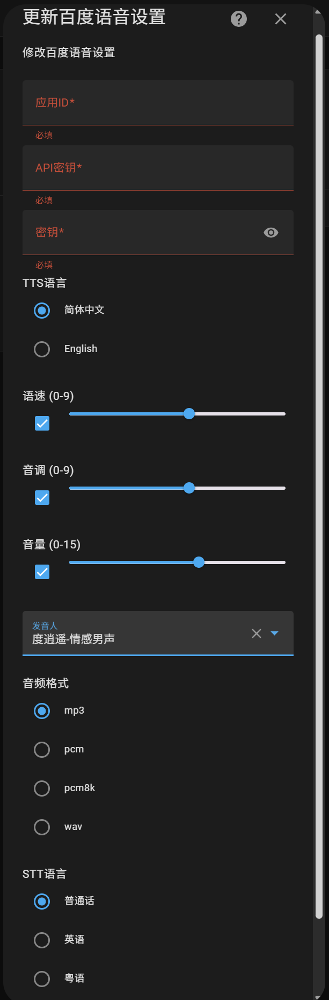

# 百度语音服务集成

这是一个 Home Assistant 集成，用于接入百度语音服务，提供文本转语音(TTS)和语音转文本(STT)功能。

## 配置要求

1. 需要在百度云创建应用
2. 开通以下服务：
   - 短语音识别服务
   - 短文本在线合成服务
   - 其它的语音库根据需求自行开通
## 安装方式
   将baidu_voice目录复制到HomeAssistant的config/custom_components目录下，重新启动HomeAssistant即可。
## 配置步骤

1. 在百度云控制台创建应用并获取 APP ID、API Key 和 Secret Key
2. 在 Home Assistant 中添加 baidu_voice 集成
3. 输入您的 APP ID、API Key 和 Secret Key,输入其它的默认设置参数
## 配置截图

##参考资料

[短语音识别标准版API](https://ai.baidu.com/ai-doc/SPEECH/Jlbxdezuf)

[短文本在线合成API](https://ai.baidu.com/ai-doc/SPEECH/mlbxh7xie)

## 注意事项

- 本集成需要互联网连接
- 使用百度语音服务可能会产生费用，请参考百度云官方计费标准

## 百度智能云服务开通界面

## 百度语音合成音色列表
[TTS全部音色查询](https://ai.baidu.com/ai-doc/SPEECH/Rluv3uq3d)

### 基础音库

| 音色ID | 音色名称 | 性别 | 描述 |
|--------|----------|------|------|
| 0 | 度小美 | 女 | 标准女主播 |
| 1 | 度小宇 | 男 | 亲切男声 |
| 3 | 度逍遥 | 男 | 情感男声 |
| 4 | 度丫丫 | 女 | 童声 |
| 5 | 度小娇 | 女 | 成熟女主播 |

### 精品音库

| 音色ID | 音色名称 | 性别 | 描述 |
|--------|----------|------|------|
| 5003 | 度逍遥 | 男 | 情感男声 |
| 5118 | 度小鹿 | 女 | 甜美女声 |
| 106 | 度博文 | 男 | 专业男主播 |
| 103 | 度米朵 | 女 | 可爱童声 |
| 110 | 度小童 | 女 | 童声主播 |
| 111 | 度小萌 | 女 | 软萌妹子 |

### 臻品音库

| 音色ID | 音色名称 | 性别 | 描述 |
|--------|----------|------|------|
| 4003 | 度逍遥 | 男 | 情感男声 |
| 4106 | 度博文 | 男 | 专业男主播 |
| 4115 | 度小贤 | 男 | 电台男主播 |
| 5147 | 度常盈 | 女 | 电台女主播 |
| 5976 | 度小皮 | 女 | 萌娃童声 |
| 5971 | 度皮特 | 男 | 老外男声 |
| 4164 | 度阿肯 | 男 | 主播男声 |
| 4176 | 度有为 | 男 | 磁性男声 |
| 4259 | 度小新 | 女 | 播音女声 |
| 4119 | 度小鹿 | 女 | 甜美女声 |
| 4105 | 度灵儿 | 女 | 清激女声 |
| 4117 | 度小乔 | 女 | 活泼女声 |
| 4288 | 度晴岚 | 女 | 甜美女声 |
| 4192 | 度青川 | 男 | 温柔男声 |
| 4100 | 度小雯 | 女 | 活力女主播 |
| 4103 | 度米朵 | 女 | 可爱女声 |
| 4144 | 度姗姗 | 女 | 娱乐女声 |
| 4278 | 度小贝 | 女 | 知识女主播 |
| 4143 | 度清风 | 男 | 配音男声 |
| 4140 | 度小新 | 女 | 专业女主播 |
| 4129 | 度小彦 | 男 | 知识男主播 |
| 4149 | 度星河 | 男 | 广告男声 |
| 4254 | 度小清 | 女 | 广告女声 |
| 4206 | 度博文 | 男 | 综艺男声 |
| 4147 | 度云朵 | 女 | 可爱童声 |
| 4141 | 度婉婉 | 女 | 甜美女声 |
| 4226 | 南方 | 女 | 电台女主播 |
| 6205 | 度悠然 | 男 | 旁白男声 |
| 6221 | 度云萱 | 女 | 旁白女声 |
| 6546 | 度清豪 | 男 | 逍遥侠客 |
| 6602 | 度清柔 | 男 | 温柔男神 |
| 6562 | 度雨楠 | 女 | 元气少女 |
| 6543 | 度雨萌 | 女 | 邻家女孩 |
| 6747 | 度书古 | 男 | 情感男声 |
| 6748 | 度书严 | 男 | 沉稳男声 |
| 6746 | 度书道 | 男 | 沉稳男声 |
| 6644 | 度书宁 | 女 | 亲和女声 |
| 4148 | 度小夏 | 女 | 甜美女声 |
| 4277 | 西贝 | 女 | 脱口秀女声 |
| 4114 | 阿龙 | 男 | 说书男声 |

### 大模型音库

| 音色ID | 音色名称 | 性别 | 描述 |
|--------|----------|------|------|
| 4179 | 度泽言 | 男 | 温暖男声 |
| 4146 | 度禧禧 | 女 | 阳光女声 |
| 6567 | 度小柔 | 女 | 温柔女声 |
| 4189 | 度涵竹 | 女 | 温暖女声 |
| 4194 | 度嫣然 | 女 | 甜美主播 |
| 4193 | 度泽言 | 男 | 温暖男声 |
| 4195 | 度怀安 | 男 | 沉稳男声 |
| 4196 | 度清影 | 女 | 清亮女声 |
| 4197 | 度沁遥 | 女 | 温柔女声 |
| 20100 | 度小粤 | 女 | 粤语女声 |
| 20101 | 度晓芸 | 女 | 粤语女声 |
| 4257 | 四川小哥 | 男 | 四川方言 |
| 4132 | 度阿闽 | 男 | 闽南语男声 |
| 4139 | 度小蓉 | 女 | 四川方言 |
| 5977 | 台媒女声 | 女 | 台湾腔 |
| 4007 | 度小台 | 女 | 台湾腔 |
| 4150 | 度湘玉 | 女 | 湖南方言 |
| 4134 | 度阿锦 | 男 | 粤语男声 |
| 4172 | 度筱林 | 女 | 温柔女声 |
